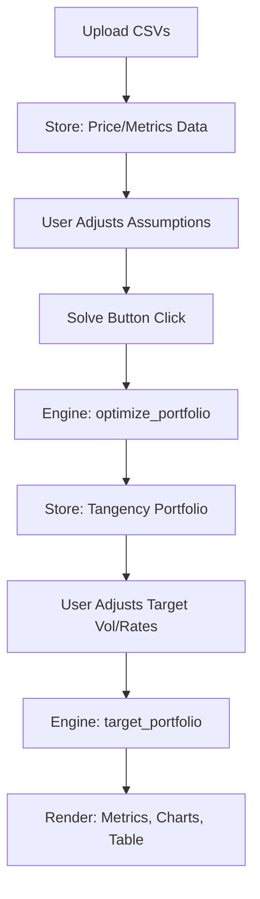

# Implementation Plan: Plotly Dash UI Migration

This plan outlines the technical migration from Streamlit to Plotly Dash, preserving the "Premium Quant" aesthetic and hardening the results display logic.

## Proposed Changes

### Core UI Framework (Dash)

- **Create `src/app.py`**: The main entry point for the Dash application.
- **Implement Layout**:
    - **Header**: Hero section with title and description.
    - **Setup Section**: File uploaders for prices and metrics, assumption sliders (Risk-free rate), and the primary "Solve" button.
    - **Results Section**: (Conditional) metrics cards, interactive Plotly charts, and the allocation table.
- **State Management**: Use `dcc.Store` to manage uploaded dataframes, tangency results, and final portfolio states across callbacks.

### Visual Components & Styling

- **Custom CSS (`assets/style.css`)**:
    - Port all CSS variables and classes from `streamlit_app.py`'s `_inject_styles`.
    - Ensure the beige/paper background and "Urbanist/Gelasio" typography are maintained.
    - Style Dash components (Upload, Slider, Button) to match the premium design system.
- **Interactive Charts**:
    - **Capital Market Line**: Use `plotly.graph_objects` to replicate the multi-layer Altair chart (Assets, CML Segments, Tangency, Target).
    - **Allocation Bar Chart**: Horizontal bar chart showing portfolio weights.

### Logic & Engine Integration

- **File Parsing**: Adapt `dcc.Upload` handling to parse CSV content into Pandas DataFrames.
- **Optimization Bridge**: Trigger existing `optimize_portfolio` and `target_portfolio` logic within Dash callbacks.
- **Robustness**: Port the `_safe_float` and unified data model patterns from the recent Streamlit "hardening" commit (`e9b9855`).

## Technical Design

### Unified Data Flow

### Component Mapping

| Streamlit Component | Dash Equivalent |
| :--- | :--- |
| `st.file_uploader` | `dcc.Upload` + `html.Div` for status |
| `st.slider` | `dcc.Slider` / `dcc.RangeSlider` |
| `st.button` | `html.Button` with `n_clicks` |
| `st.altair_chart` | `dcc.Graph` with Plotly Figure |
| `st.markdown` (Custom CSS) | `assets/style.css` + `html.Div` |
| `st.session_state` | `dcc.Store` (session storage) |

## Verification Plan

### Automated Tests
- **Integration Tests**: Use `dash.testing` (pytest plugin) to simulate the full user flow (Upload -> Solve -> Verify Results).
- **Regression Tests**: Ensure the `engine` unit tests still pass.

### Manual Verification
1. **Thematic Consistency**: Verify the "Beige/Paper" look matches the original Streamlit version.
2. **Interactive Charting**: Confirm CML points show correct tooltips and the cross marker moves smoothly with the Target Vol slider.
3. **Edge Cases**: Test with empty files, negative rates, and extreme volatility targets.
